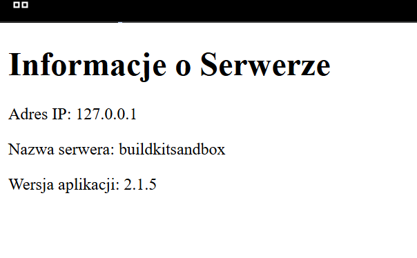
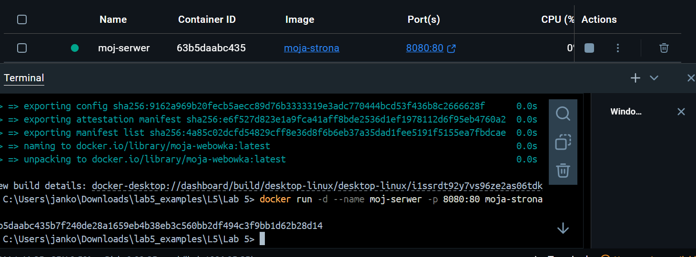
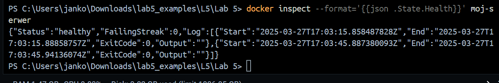

# PAwChO_Lab5
 Zadanie: Laboratorium 5 </br>
 Autor: Jan Kowalski (99589) </br>
 Grupa Laboratoryjna: 6.7 (Środa 18.45)
 # Treść Dockerfile:
 ```
# Etap 1: Budowanie aplikacji
FROM alpine:3.18 AS builder

# Instalacja narzędzi potrzebnych do generowania strony
RUN apk add --no-cache bash

# Ustawienie katalogu roboczego
WORKDIR /app

# Zdefiniowanie argumentu VERSION
ARG VERSION=1.0.0

# Skrypt generujący stronę informacyjną
RUN echo '#!/bin/sh' > generate-page.sh && \
    echo 'cat << EOF > index.html' >> generate-page.sh && \
    echo '<!DOCTYPE html>' >> generate-page.sh && \
    echo '<html>' >> generate-page.sh && \
    echo '<head><title>Informacje o Serwerze</title></head>' >> generate-page.sh && \
    echo '<body>' >> generate-page.sh && \
    echo '<h1>Informacje o Serwerze</h1>' >> generate-page.sh && \
    echo '<p>Adres IP: '"'"'$(ip addr show eth0 | grep -oP "(?<=inet\s)\d+(\.\d+){3}")'"'"'</p>' >> generate-page.sh && \
    echo '<p>Nazwa serwera: '"'"'$(hostname)'"'"'</p>' >> generate-page.sh && \
    echo "<p>Wersja aplikacji: $VERSION</p>" >> generate-page.sh && \
    echo '</body>' >> generate-page.sh && \
    echo '</html>' >> generate-page.sh && \
    echo 'EOF' >> generate-page.sh && \
    chmod +x generate-page.sh && \
    ./generate-page.sh

# Etap 2: Konfiguracja serwera Nginx
FROM nginx:alpine

# Skopiowanie wygenerowanego pliku index.html z pierwszego etapu
COPY --from=builder /app/index.html /usr/share/nginx/html/index.html

# Ustawienie uprawnień pliku
RUN chmod 644 /usr/share/nginx/html/index.html

# Dodanie HEALTHCHECK do monitorowania stanu kontenera
HEALTHCHECK --interval=30s --timeout=10s --start-period=5s --retries=3 \
    CMD wget -q -O /dev/null http://localhost || exit 1

# Domyślny port Nginx
EXPOSE 80

# Domyślne polecenie uruchamiające Nginx
CMD ["nginx", "-g", "daemon off;"]
 ```
# Polecenie wykorzystane do budowy:

```
docker build --build-arg VERSION=2.0.0 -t moja-strona .
```

# Polecenie uruchamiające serwer:

```
docker run -d --name moj-serwer -p 8080:80 moja-strona
```

# Polecenie wyświetlające szczegóły kontenera: 

```
docker inspect --format='{{json .State.Health}}' moj-serwer
```

# Zrzuty ekranu:
1.Status w przglądarce:</br>
 
</br></br>
2.Uruchomienie i stan kontenera:

</br></br>
3.HealthCheck:
